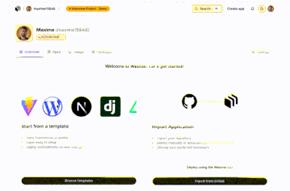

# Wasmer IO Interface

**Live demo:** https://wasmer-io-interface.wasmer.app

A frontend replica of the [wasmer.io](https://wasmer.io) user profile page, built as a simple example showcasing a few UI improvements over the original website.

## UI/UX Improvements

- **Sticky navbar** — the top navigation bar remains visible while scrolling, improving navigation on long pages
- **Dark mode toggle** — sun/moon button in the navbar switches between light and dark themes
- **Hover lift on cards** — cards lift slightly on hover (Vercel-style) for a more interactive feel
- **Copy-to-clipboard user ID** — click the user ID badge to copy it; shows a checkmark confirmation
- **Command palette (Cmd+K)** — quick-action modal to navigate tabs, copy user ID, toggle theme, and open external links
- **Populated app card** — the Apps tab shows the deployed app with a live screenshot thumbnail, clickable URL, deployer info, and a green live status indicator

## Live Data

- **Live packages data** — the Packages tab fetches real data from the Wasmer GraphQL API (`registry.wasmer.io/graphql`) client-side, no hardcoding
- **Live relative timestamps** — activity timestamps (e.g. "4 minutes ago") update automatically every 30 seconds client-side
- **Real GitHub profile image** — avatar is fetched from `github.com/<username>.png`, a public endpoint requiring no authentication

